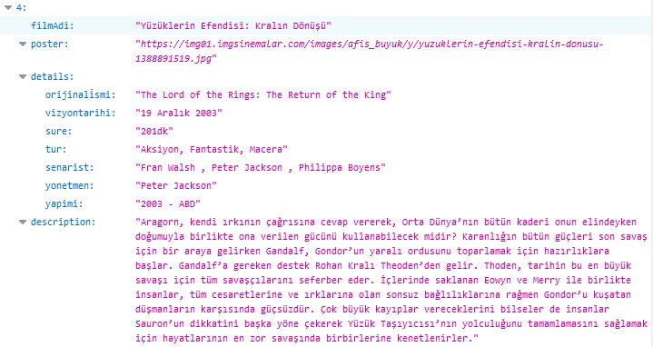

# Sinema Crawler
Bir web sitesindeki sinema listesini ve o listedeki sinemaların çıkış tarihi, açıklaması, türü gibi verileri json olarak kaydeden python scriptidir. Selenium kütüphanesi kullanılarak hazırlanmıştır. Aşağıda görebileceğiniz şekilde sinema verilerini json dosyasına toplamaktadır.
```json
  "4": {
    "filmAdi": "Yüzüklerin Efendisi: Kralın Dönüşü",
    "poster": "https://img01.imgsinemalar.com/images/afis_buyuk/y/yuzuklerin-efendisi-kralin-donusu-1388891519.jpg",
    "details": {
      "orijinali̇smi": "The Lord of the Rings: The Return of the King",
      "vizyontarihi": "19 Aralık 2003",
      "sure": "201dk",
      "tur": "Aksiyon, Fantastik, Macera",
      "senarist": "Fran Walsh , Peter Jackson , Philippa Boyens",
      "yonetmen": "Peter Jackson",
      "yapimi": "2003 - ABD"
    },
    "description": "Aragorn, kendi ırkının çağrısına cevap vererek, Orta Dünya’nın bütün kaderi onun elindeyken doğumuyla birlikte ona verilen gücünü kullanabilecek midir? Karanlığın bütün güçleri son savaş için bir araya gelirken Gandalf, Gondor’un yaralı ordusunu toparlamak için hazırlıklara başlar. Gandalf’a gereken destek Rohan Kralı Theoden’den gelir. Thoden, tarihin bu en büyük savaşı için tüm savaşçılarını seferber eder. İçlerinde saklanan Eowyn ve Merry ile birlikte insanlar, tüm cesaretlerine ve ırklarına olan sonsuz bağlılıklarına rağmen Gondor’u kuşatan düşmanların karşısında güçsüzdür. Çok büyük kayıplar vereceklerini bilseler de insanlar Sauron’un dikkatini başka yöne çekerek Yüzük Taşıyıcısı’nın yolculuğunu tamamlamasını sağlamak için hayatlarının en zor savaşında birbirlerine kenetlenirler."
  }
```
<br>
Ekran görüntüsü:
<br>

<br>
Bu listede yaklaşık olarak 14000 civarı filmin verisi bulunuyor. Bot, listedeki bütün filmlerin sayfalarına girip açıklamaları ve çıkış yılını vs. okuyor. Bu bilgi direkt listede yoktu, bana da açıklama kısmı lazım oldu. O yüzden bunu kodladım. Headless olarak daha hızlı çalışıyor, o yüzden headless bıraktım. Ayrıca adblocker eklentisi olan bir profil eklerseniz çok daha hızlı sayfa yüklenmesi sağlanıyor ve bu sayede taramayı daha çabuk tamamlıyor.

Bu script hiçbir ticari amaç barındırmamaktadır, tamamen eğitim ve pratik amaçlı oluşturulmuştur.
